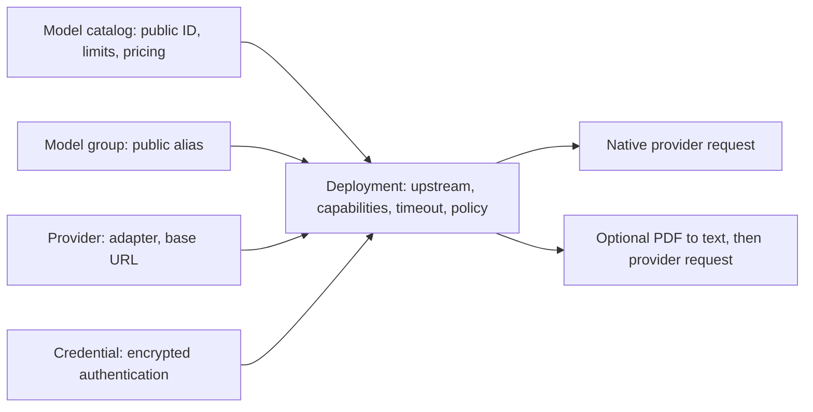

# Managed control plane

## Ресурсы и зависимости

Конфигурация намеренно разделена на независимые сущности:

```text
Provider ──┐
           ├─> Deployment ─> Model Group
Credential ┘       │
                   └─> Model Catalog pricing/capabilities
```

- Provider хранит adapter type, base URL и enabled state.
- Credential хранит write-only secret, optional provider binding и metadata.
- Deployment связывает provider/credential с upstream и public models,
  capabilities, routing, admission и guardrail policy.
- Model Group задаёт public alias, deployment membership, strategy, retries и
  fallbacks.
- Model Catalog хранит versioned pricing, limits и model capabilities.

### Model и Deployment

**Model** — публичный идентификатор и описание модели: pricing, context limits и
заявленные возможности. **Deployment** — конкретный способ исполнения: provider,
upstream model, credential, timeout, quotas, routing и security policy. Один public
model может обслуживаться несколькими deployments с разными credentials и
возможностями. Model Group дополнительно объединяет deployments под alias.

Capability в каталоге не включает поддержку в adapter. Router выбирает только
кандидатов, совместимых с операцией, возможностями модели, настройками deployment
и реальным adapter contract. `file_input` нельзя включить у adapter, который не
принимает файлы. Настраиваемый список в UI определяется
`GET /admin/v1/provider-capabilities`; наличие OpenAI-compatible URL не доказывает
поддержку всех операций.

`document_processing=docling` — отдельная политика preprocessing. Для inline PDF
Gateway преобразует документ в текст перед Chat/Responses. Она позволяет
использовать текстовую модель без native `file_input`, но не добавляет ей native
Responses storage, vision или PDF support. `native` оставляет исходный файл
провайдеру. См. [обработку документов](document-processing.md).



Catalog capabilities и deployment capabilities проверяются отдельно; подробные
operation-specific ограничения описаны в [Inference API](inference.md).

UI выбирает существующие IDs из списков. API намеренно принимает ссылки по ID,
проверяет provider binding и возвращает `409 resource_in_use`, если удаление
сломает Deployment, Model Group или fallback chain.

## Persistence

Без `PROVIDER_CONTROL_PLANE_POSTGRES_DSN` управление process-local; encryption
key генерируется на процесс и подходит только для разработки. С DSN gateway
требует стабильный `CREDENTIAL_ENCRYPTION_KEY` минимум из 16 байт для существующих установок; используйте 32+ байта
для общего ключа Gateway/Auth и managed SSO. Существующее значение не меняйте при
переименовании переменной. См. [совместимость ключей](admin-sso-settings.md#совместимость-ключей).

Providers, encrypted Credentials, Deployments, Model Groups, model catalog,
guardrails/attachments, tags, projects/access groups, MCP, agent/tool policies и
logging destinations сохраняются в одном versioned JSONB snapshot. Запись
использует optimistic revision; конфликт другой replica возвращает
`409 revision_conflict`, а неуспешная persistence откатывает runtime mutation.

Credentials и logging secrets сохраняются AES-GCM ciphertext+nonce. Read API
возвращает только metadata; пустой secret при edit сохраняет прежнее значение,
а rotate является отдельной audited операцией.

## UI

Встроенный route-based React UI доступен на `/ui/` и использует только
документированные `/admin/v1/*` endpoints. Он не является доверенной security
boundary: gateway повторно выполняет authentication, RBAC и audit.

Основные блоки:

- AI Gateway: Virtual Keys, Playground, Models & endpoints, Agentic, MCP,
  Skills, Tools, Guardrails и Policies;
- Observability: Overview, Usage & spend, Customer insights, Cost optimization,
  Logs, Routing diagnostics и Guardrail monitor;
- Access Control: Organizations, Teams, Users, Access groups, Projects и Budgets;
- Developer Tools: API reference, AI Hub, Response cache и Tag management;
- Settings: Router settings, Logging & alerts и Single sign-on.

Подменю скрывают недоступные страницы и пустые группы; при прямом переходе
раскрывается группа активной страницы. URL, backend RBAC и route capabilities
остаются независимыми от оформления sidebar. Полный список страниц и условий
доступа: [Admin UI](admin-ui.md).

Route manifest содержит 36 навигационных страниц. Таблицы используют общий
поиск, columns/filter menus, sorting, pagination и action menu. Детали UI и
frontend checks описаны в
[UI README](../repos/gateway/ui/README.md).

## Audit и observability

Management mutation сначала пишет PostgreSQL audit event `attempted`, затем
`succeeded` или `failed`. Side effect не выполняется, если audit preflight
недоступен. Audit identity берётся из authenticated gateway context, а не из
клиентского JSON.

Usage, request logs и audit logs остаются разными источниками. UI не вычисляет
ledger самостоятельно и не объединяет расходы разных currencies.
