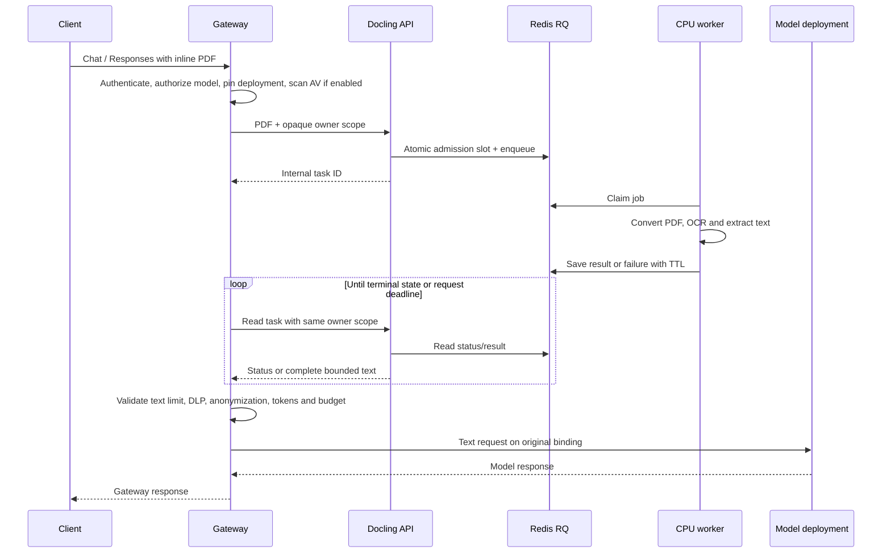

# Document processing

Model deployments have an optional `document_processing` field: `native` or
`docling`. Omission keeps the existing policy on update; deployments created
without the field retain native behavior. This is an additive management API
change. It does not change the model or adapter's native `file_input` capability.

Docling conversion is an opt-in gateway operation. Deployment processing policy,
provider credentials and guardrail policy must remain bound throughout a request.
Converted content must pass authorization, security checks and token accounting
before inference. A failed or partial conversion must never fall back to passing
an opaque document to a model.

## Runtime

The optional stack has three roles: the internal HTTP API, a dedicated Redis RQ
queue, and CPU workers. It uses Docling Serve 1.36.0 / JobKit 3.8.1 / RQ 2.12.0;
the upstream image is pinned by its multi-platform digest. The API adds bounded
admission and a narrow authenticated request boundary; document conversion and
worker lifecycle remain upstream implementations. Upgrade these together and run
the real integration suite before changing the pin.

Only inline PDF attachments in Chat Completions and Responses are accepted in
this version. Extracted Markdown includes table text and OCR output. Images and
charts are not passed as interpreted visual content. Other document formats and
OCR language profiles need their own validated API contracts and fixtures.

The API authenticates before decoding a body and requires an opaque scope derived
from organization, credential and user. Task IDs are internal and are never
exposed as inference API resources. Both task status and result reads enforce the
same owner. The API accepts exactly one uploaded PDF per task, no URL sources,
callbacks, remote targets, custom pipeline options or model downloads. The API's
explicit request boundary is authoritative; upstream allowlist configuration
alone is not sufficient for this pinned release.

Gateway authorizes the model before submitting documents. An enabled AV policy
scans the original file before conversion. Converted text and filenames pass
through DLP/anonymization and subsequent TPM and budget accounting. The gateway
checks the configured catalog `max_input_tokens` using its existing estimate;
configure this for models with a known context limit. The combined converted text
is capped at 4 MiB. Partial, empty, failed or oversized output is rejected without
truncation, provider inference or automatic native fallback.

A prepared request binds the deployment, credential reference, model aliases and
processing/guardrail policy. A changed binding stops routing. Converted requests
do not use model/deployment fallback or shadow mirroring; a retry on the same
binding remains available. The binding participates in exact and semantic cache
isolation and is retained by background job serialization.

Defaults: 16 unfinished jobs globally, 120 seconds queued TTL, 120 seconds worker
job timeout, 32 pages / 16 MiB per PDF, 600 seconds result/failure retention, and
four concurrent HTTP requests per API process. Slot membership and RQ enqueue are
committed in one Redis transaction; slots follow queued/started/terminal job
state and are not freed on client disconnect. A canceled client does **not**
cancel the worker. Queued jobs expire, running jobs have a timeout, and abandoned
results expire. Finished/missing jobs are reclaimed during admission. API task
caches are pruned, including jobs that expired with no connected poller.

Redis has a 512 MiB `noeviction` limit and AOF persistence. Capacity exhaustion
returns an explicit busy response; Redis failures fail closed. Memory pressure
may reject a job before the cardinality limit. AOF `everysec` can lose up to the
last second of writes after an abrupt host failure; this is a conversion queue,
not a billing ledger. Successful result reads promptly remove RQ job payloads;
unfetched task payloads/results are retained only for the configured TTL. Redis
and its persistent storage contain document data: restrict network/storage access
and apply platform encryption at rest. This initial stack uses one Redis instance.

Conversion duration/results are recorded through the existing provider observer
under `document_conversion`. Logging uses server-owned filenames and a constant
RQ job description; no uploaded body, service key or extracted text is added to
processing logs.

## Enablement

Отключение клиента прекращает ожидание Gateway, но не освобождает очередь
раньше завершения/expiry задания. Политика worker timeout и result TTL
ограничивает оставшуюся работу. Ни API task ID, ни plaintext PDF не попадают
в публичную inference metadata.

In UI open **Deployments → Edit → Document processing (PDF)** and choose `docling`.
`native` requires a genuine native file-input deployment; `docling` requires Chat
or Responses support but does not require native `file_input` on model/adapter.
Pause/resume and onboarding updates preserve the processing policy.

For Ollama PDF requests in Playground, leave **Use API session management** off.
The default browser-history mode sends `store: false` and replays prior turns.
Docling enables document-to-text conversion; it does not add native Responses
storage or `previous_response_id` support to Ollama.

Gateway environment:

- `DOCLING_URL`: internal API base URL; unset disables the client.
- `DOCLING_API_KEY`: private shared internal service key.
- `DOCLING_TIMEOUT_SECONDS`: full conversion wait, default 240 (maximum 600).
- `DOCLING_POLL_MILLISECONDS`: status polling interval, default 500.
- `DOCLING_MAX_TEXT_BYTES`: per-result decoded text limit, default 4194304;
  the combined request text limit remains 4194304.

Docling API/worker configuration is separate from Gateway configuration:

| Variable / Helm field | Default or source | Meaning |
| --- | --- | --- |
| `DOCLING_SERVE_API_KEY` | Existing Secret `api-key` | Internal API authentication; Gateway uses the matching `DOCLING_API_KEY` |
| `DOCLING_SERVE_ENG_RQ_REDIS_URL` | Existing Secret `redis-url` | Dedicated RQ connection for API and workers |
| `DOCUMENT_QUEUE_CAPACITY` / `docling.capacity` | `16`, valid 1–1024 | Global unfinished job slots |
| `DOCUMENT_QUEUE_WAIT_SECONDS` / `docling.queueWaitSeconds` | `120`, valid 1–600 | TTL before a queued job starts |
| `docling.workerReplicas` | `2` | Workers; capacity is not multiplied by replica count |
| `DOCLING_PORT` (Compose only) | `5001` | Host loopback publication; not a Gateway provider port |
| `DOCLING_SERVE_ENG_RQ_JOB_TIMEOUT` / `DOCLING_SERVE_MAX_DOCUMENT_TIMEOUT` | Image pin: `120` seconds | Running conversion timeout |
| `DOCLING_SERVE_ENG_RQ_RESULTS_TTL` / `DOCLING_SERVE_ENG_RQ_FAILURE_TTL` | Image pin: `600` seconds | Terminal payload retention |
| `DOCLING_SERVE_MAX_NUM_PAGES` / `DOCLING_SERVE_MAX_FILE_SIZE` | Image pin: `32` / `16777216` bytes | Conversion bounds, independent of Playground's 8 MiB attachment limit |
| `DOCLING_NUM_THREADS` / `DOCLING_DEVICE` | Image pin: `2` / `cpu` | Conversion runtime |

The pinned [Dockerfile](../services/docling/Dockerfile) also disables upstream UI,
API docs, remote services and capabilities discovery, requires `rq`, restricts
sources/targets and limits Redis timeouts/options cache. These image settings
are part of the validated boundary, not user-selectable deployment capabilities.
The wrapper applies its own PDF/owner/request checks in addition to them.
Helm resource/scratch limits are in [values](../charts/ai-gateway/values.yaml);
do not raise document limits without re-running the real processing suite.

Local optional services are in `docker-compose.docling.yml`. Supply a private env
file containing `DOCLING_API_KEY`, then start it with
`docker compose --env-file /path/to/private.env -f docker-compose.docling.yml up -d`.
The API is published only on loopback; Redis/workers have an internal network.
This does not reconfigure an existing Gateway container or Kubernetes release.

Helm defaults keep the stack disabled. Set `docling.enabled=true`, the built or
published `docling.image.repository/tag`, and `docling.existingSecret`. Provision
that Secret separately with `api-key`, `redis-password` (URL-safe alphanumeric,
underscore or hyphen), and `redis-url` pointing to
`<release-fullname>-docling-redis:6379` with the matching password. The chart
references secrets, provisions a queue PVC, resource limits and NetworkPolicies.
The API accepts traffic from Gateway pods; workers/API can reach only Redis and
cluster DNS. Adapt the DNS policy for a cluster using different DNS labels.
Kubernetes needs a CNI that enforces NetworkPolicy. No existing Secret or working
deployment is modified by adding these templates.

## Ошибки и диагностика

| Gateway status / code | Причина | Действие |
| --- | --- | --- |
| `503 document_queue_full` | Admission limit или недостаток queue capacity | Проверить workers, Redis memory и зависшие задания; не увеличивать лимит без проверки ресурсов |
| `503 document_processing_unavailable` | Internal API/queue недоступны | Проверить API readiness, service routing и secret references |
| `504 document_processing_timeout` | Истекло время ожидания conversion | Проверить worker duration, число страниц и CPU; HTTP cancellation не отменяет worker |
| `413 document_context_too_large` | Converted text или input context превышает лимит | Сократить документ либо выбрать модель с подтверждённым большим context; текст не обрезается молча |
| `400 content_rejected` | Pre-conversion security rejection | Проверить policy/AV; provider inference не запускается |
| `502 document_processing_failed` | Неполный, пустой, некорректный result или другая conversion error | Проверить metadata-only processing logs; native fallback запрещён |

Это mapping document preparation в
[Gateway handler](../repos/gateway/internal/gateway/document_processing.go).
Другие стадии имеют собственные коды: `provider rejected parameter store` у
Ollama относится к native Responses storage; provider `context deadline exceeded`
после conversion относится к inference timeout. Увеличение `Maximum output tokens`
не увеличивает input context и не лечит timeout; configure catalog input limit
и deployment timeout отдельно.

### Проверки реализации

`python3 services/docling/check.py` builds the image and creates a unique isolated
stack. It checks real Redis/RQ admission concurrency, stopped workers, explicit
source restrictions, owner isolation, API/Redis restart, text extraction, actual
OCR of a generated English scanned page, malformed PDFs, the 32-page limit,
queue recovery, and the Gateway Go client. It stops only that test stack and keeps
its resources; it never removes
existing containers/images/volumes. The CI job runs this suite unconditionally.
The Go client test uses `-tags=doclingintegration` and requires a real service.

Unit/regression tests cover HTTP cancellation, redirects, partial/oversized
results, authorization before conversion, input copying, catalog context limits,
cache/binding/background isolation, and delivery to the Ollama adapter for Chat
and Responses. PostgreSQL integration verifies persistence and rollback of the
new policy. The OCR fixture proves English recognition; Russian recognition has
not been established by this suite.
