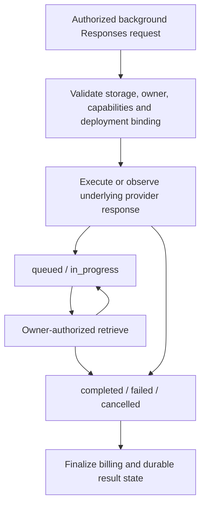
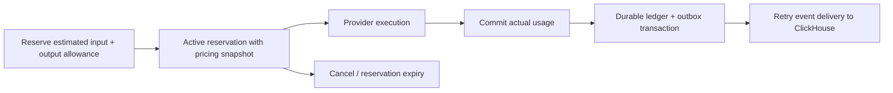

# Жизненный цикл ресурсов и учёта

Этот документ объединяет правила ownership, background execution и billing.
Точные payload и статусы каждой операции находятся в [индексе API](api-index.md)
и [OpenAPI](../repos/gateway/api/openapi.yaml). Состояния Responses, batches,
fine-tuning и video jobs имеют разные provider contracts; их нельзя объединять
в одну универсальную очередь.

## Владение ресурсами

Organization — tenant boundary. Её определяет проверенная identity и directory
binding, а не переданный клиентом organization header. Inference resources также
имеют credential/user ownership: принадлежность одной организации сама по себе
не даёт произвольному её пользователю доступ к чужому файлу или response.
Проверки organization management и `org_admin` описаны в
[Organization identity](organization-identity.md).

| Ресурс | Контракт и хранение | Правило жизненного цикла |
| --- | --- | --- |
| Provider, Credential, Deployment, Model Group | Versioned control-plane PostgreSQL snapshot | CAS revision, encrypted secrets, referential checks и audited mutations; [control plane](control-plane.md) |
| Files, Conversations, Assistants, vector stores | Owner-bound Gateway resources в PostgreSQL | Quotas, проверки владельца и связей; public API не предоставляет SQL/storage access |
| Stored Responses / Interactions | Original deployment ownership binding, durable records при настроенном PostgreSQL | Retrieve/delete/cancel продолжают использовать исходный deployment; изменение binding отклоняется |
| Batches, fine-tuning, video jobs | Gateway owner metadata плюс provider job lifecycle | Не переносить provider job на другой upstream; отсутствие нужной capability отклоняется |
| A2A tasks | Owner-bound task metadata и underlying Responses execution | Tasks имеют quota/TTL; subscriptions ограничены отдельно и не заменяют durable execution |
| Docling tasks | Internal Redis RQ с PDF payload и result TTL | Не являются публичными `/v1/*` jobs; cancellation HTTP не отменяет worker |
| Billing reservations / ledger | PostgreSQL | Один внутренний execution ID на независимый запрос, reserve → commit/cancel; TTL освобождает забытый reserve |
| Usage events | Durable billing outbox → ClickHouse | At-least-once delivery; `event_id` нужен для дедупликации |

Public ID не является разрешением доступа. После lookup Gateway проверяет
владельца, актуальные grants и исходный binding; storage errors не превращаются
в разрешение. TTL ownership не является обещанием того, что provider удалил
свой ресурс. Операции, expiration и компенсация provider-side создания подробно
описаны в [Inference API](inference.md).

## Background Responses

`background=true` требует `store=true`, совместимого deployment и durable
storage. Это не способ включить background lifecycle у произвольного local
adapter. Для Ollama в Playground используйте browser-history mode, если native
storage не поддерживается.

Схема отражает публичные состояния, а не единый worker implementation. Gateway
сохраняет ownership и сериализованные prepared bindings; callbacks, polling и
cancel зависят от операции и adapter. Conversation pending items остаются
отдельно от committed history до завершения. Не повторяйте create после потери
связи, предполагая, что provider ничего не исполнил: сначала проверьте известный
response/job ID. Подробности и варианты recovery находятся в Inference API.

## Billing, cache и сбои

`X-Request-ID` — клиентская корреляция. `X-Execution-ID` — внутреннее исполнение,
которое используется в billing/request logs. Два независимых запроса с одинаковым
внешним ID не должны дедуплицироваться как одна финансовая операция.

`max_tokens` и `max_completion_tokens` участвуют в output allowance, а tools и
прочий tokenizable context — во входной оценке. Commit сохраняет pricing snapshot
из reserve. Provider usage имеет приоритет над estimate; отсутствие usage и
proxy cache hit явно различаются. Cache entry изолируется по credential, user и
effective policy, включая prepared document binding. Точные ограничения,
memory eviction и failure counters описаны в [конфигурации](configuration.md),
[архитектуре](architecture.md) и [production reliability](production-reliability.md).

Memory outbox не даёт restart durability. Для надёжного учёта нужны PostgreSQL
и `BILLING_DURABLE_OUTBOX_ENABLED=true`; восстановление ClickHouse не должно
требовать повторного provider inference. Непрочитанный Docling result, потерянный
HTTP response и недоставленный billing event — разные recovery scenarios.
